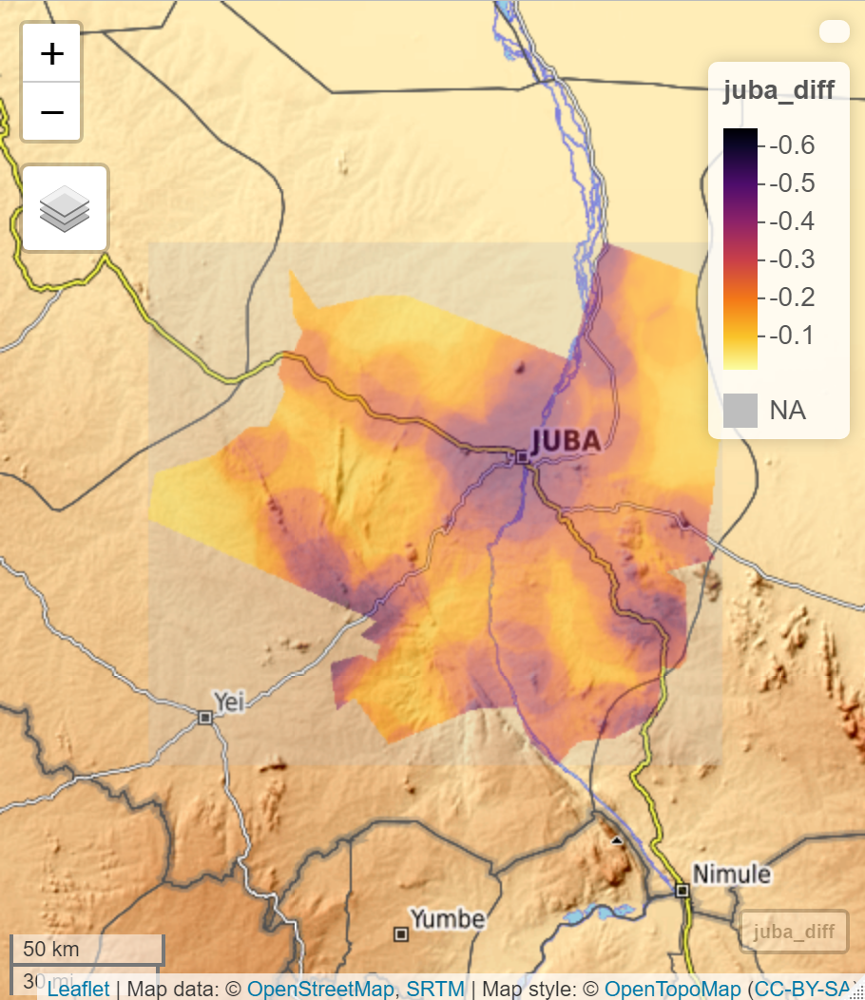

# South Sudan

Final project on South Sudan.

# Administrative Subdivisions of South Sudan & Population Density

South Sudan is composed of 10 major states and 78 major subdivisions. Bordering South Sudan is Sudan to the north, Ethiopia to the east, Central African Republic to the west, and Uganda to the south. The two major subdivisions I focused on were Juba, the capital city of South Sudan, and Malakal, which are the two biggest cities in South Sudan and make up most of the population in the country. Central Equatoria and Jonglei compose of Juba and Malakal, respectively, and make up a large part of the population density in South Sudan. Most of the population is located on the eastern border closer to Ethiopia, due to the desertous regions in the western part of the country, as well as the South Sudanese Civil War influencing where the people live (they tend to live in cities that are controlled by rebel groups, as opposed to the territory controlled by the government of South Sudan). 

# Population of Juba & Analysis of Population Estimates

Juba is the most populated city in South Sudan, and most of the area is relatively urbanized, which can be seen with the overestimation of population within the subdivision. Specifically within the city, most of the population is heavily overestimated, but changes in smaller towns in Juba. Most other subdivisions have a severe underestimation because of the western areas having much lower population densities due to the state of the war. 

# South Sudan's Population & Variables within the Population

There are three main subdivisions that have the highest population density, and a handful of smaller areas that are much less dense. There was a relatively strong relationship between the variables observed, with an R-squared value of 0.5495, which is an indicator that there is some amount of correlation between the variables but it is not the strongest it can be. Night time lights was at its highest presumably when the population density was higher, considering that urban areas tend to use more lights than other less populated areas. 

# Distribution of Roadways, Health Facilities, and Water Bodies in Malakal

Shifting towards Malakal, this is the second most populated region in South Sudan and very urbanized. One of the main features of Malakal's urban areas is the two main roadways that were developed. There is a major river running through Malakal which allowed for urban areas to be developed around the river, with roadways linking the two ends of the subdivision, while providing accessible healthcare. Health facilities are concentrated in one of the urban area points that were defined, which is a good indication that there is a healthy access to healthcare. Additionally, health facilities are still present in other areas of the whole urban area. 

# Topography of Malakal, South Sudan

Malakal is located in the northeastern end of South Sudan, which is much more desertous than the southeastern side. As a result, there is very little topography besides the aforementioned river in the primary urban area. However, this makes building an urbanized city much easier, considering there is much less to build around when building a city. The river influenced the fact that more transportation needed to be built around it since there was no direct link between the two sides of the area, but it allowed for increased transportation methods and increased health care facilities on both sides of the river. 

# State of Healthcare Assessment

Healthcare, while accessible, is still somewhat of an issue in South Sudan given the state of the Civil War and the high birth + high death rates. Juba and Malakal are urban areas that are hubs for rebel groups, which are potential targets for the South Sudanese government to siege. As a result, there are many deaths in the area that carry over into health facilities in both of these subdivisions. Child soldiers are also increasing. This poses elevated health and safety risks, with communicable diseases spreading through soldiers and the overall danger increasing when the government of South Sudan is involved. Additionally, South Sudan is still growing rapidly and experiences high birth and death rates, which increases the need for healthcare, which possibly decreases accessibility. 

